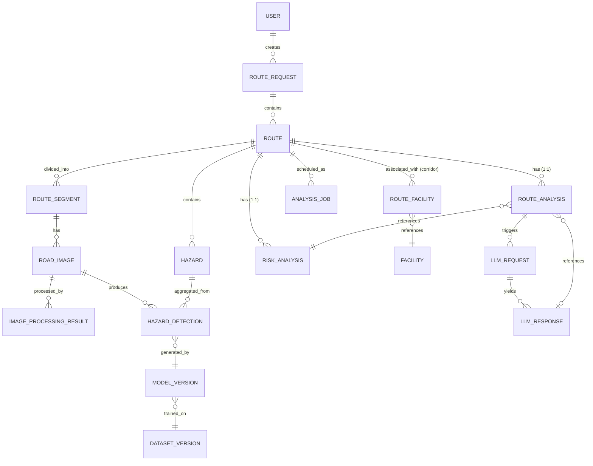

# 04_DATA_MODEL.md — Data Model Specification

**Project:** SafeRoute AI — Intelligent Road Safety Navigation System
**Document:** Data Model Specification (authoritative)
**Version:** 1.0
**Status:** Implementation-Ready
**Authority:** `MASTER_RULES.md` > `01_PRD.md` > `02_TRD.md` > this document
**Companion:** `05_DATA_SOURCES.md`, `07_API_CONTRACT.md`, `docs/DATABASE.md`

---

## 1. PROJECT CONTEXT

SafeRoute AI is an intelligent route-analysis platform that:

1. Accepts a source and destination from the user.
2. Uses a routing provider to generate up to 4 candidate routes.
3. Normalizes provider-specific route data into the SafeRoute AI internal model.
4. Divides routes into analyzable segments.
5. Obtains road imagery associated with route segments.
6. Uses OpenCV for image validation and preprocessing.
7. Uses a trained YOLO11 model to detect road hazards.
8. Aggregates image-level detections into route-level hazard information.
9. Uses a deterministic Risk Engine to calculate a project-defined road-risk score.
10. Searches for nearby facilities around each route:
    - Hospitals
    - Medical stores / pharmacies
    - Restaurants
    - Hotels
    - Petrol pumps / fuel stations
    - Police stations
11. Keeps road safety data separate from facility/convenience data.
12. Creates a structured Route Profile.
13. Sends verified structured information to an LLM.
14. Uses the LLM only as an explanation layer.
15. Displays route, hazard, risk, and facility data on the frontend.

Core pipeline (this document's schema must support every box):

```
USER → FRONTEND → BACKEND API → ROUTING PROVIDER → ROUTE NORMALIZATION
→ ROUTE / SEGMENT DATA → ROAD IMAGE DATA → OPENCV → YOLO11
→ HAZARD DETECTION → HAZARD AGGREGATION → RISK ENGINE
→ FACILITY ENGINE → ROUTE PROFILE → LLM EXPLANATION → FRONTEND
```

---

## 2. DOCUMENT AUTHORITY & CONSISTENCY

This document:

- Respects `MASTER_RULES.md`, `01_PRD.md`, `02_TRD.md`, `03_ARCHITECTURE.md`, `05_DATA_SOURCES.md`.
- Does not invent what other documents already define.
- Stays consistent with the PRD, TRD, and Architecture at all times.

If this model conflicts with an existing implementation:

1. Do not silently overwrite existing architecture.
2. Identify the conflict.
3. Preserve working functionality.
4. Document the required migration/change.
5. Follow `MASTER_RULES.md`.

---

## 3. PRIMARY OBJECTIVE

An implementation-ready specification defining for every entity:

- Responsibility
- Fields, data types, required/optional
- Primary/foreign keys, unique/check constraints, defaults
- Relationships and cardinality
- Indexes, geospatial data, timestamps, statuses, enumerations
- Data lifecycle, retention, caching, soft-deletion, auditability
- Data provenance and traceability (route/hazard/facility/analysis/model)
- Privacy and migration considerations

---

## 4. CORE DATA PRINCIPLE

SafeRoute AI maintains strict separation of these data domains. **Do not merge unrelated concepts into one table.**

```
A. ROUTE DATA                  (RouteRequest, Route, RouteSegment)
B. ROAD IMAGE DATA             (RoadImage, ImageProcessingResult)
C. COMPUTER VISION DATA        (ImageProcessingResult, HazardDetection, model link)
D. HAZARD DATA                 (HazardDetection → Hazard)
E. RISK DATA                   (RiskAnalysis)
F. FACILITY DATA               (Facility, RouteFacility)
G. ROUTE ANALYSIS DATA         (RouteAnalysis)
H. AI/ML MODEL DATA            (ModelVersion, DatasetVersion)
I. LLM EXPLANATION DATA        (LLMRequest, LLMResponse)
J. REQUEST / JOB / SYSTEM DATA (RouteRequest status, AnalysisJob, AuditLog)
```

**Consequence:** hazards never mix with facilities; risk never mixes with the LLM; model versioning is a first-class cross-cutting dimension.

---

## 5. ENTITY MAP (20 candidates evaluated)

| # | Entity | Required? | Decision & reason |
|---|--------|-----------|-------------------|
| 1 | User | **Conditional** | Only if auth enters scope. PRD v1 has no accounts → NOT created in v1. |
| 2 | RouteRequest | **Yes** | One user request → 0–4 routes. Owned by backend/API. |
| 3 | Route | **Yes** | Normalized candidate route (≤4 per request). |
| 4 | RouteSegment | **Yes** | Analyzable portion of a route; owns image collection. |
| 5 | RoadImage | **Yes** | Source imagery with provenance per segment. |
| 6 | ImageProcessingResult | **Yes (minimal)** | OpenCV output + status per image; required for preprocessing audit. |
| 7 | HazardDetection | **Yes** | One YOLO inference result (image-level). |
| 8 | Hazard | **Yes** | Aggregated/unique physical hazard (post-dedup). |
| 9 | RiskAnalysis | **Yes** | Deterministic risk output + traceable components. |
| 10 | Facility | **Yes** | Normalized external facility (single table, categorized). |
| 11 | RouteFacility | **Yes** | Route↔facility association within corridor. |
| 12 | RouteAnalysis | **Yes** | Aggregated status/profile of one route's analysis. |
| 13 | AnalysisJob | **Yes (v2 of processing)** | Required when analysis is async. Minimal now; expand later. |
| 14 | ModelVersion | **Yes** | Mandatory traceability for every detection. |
| 15 | DatasetVersion | **Yes** | Tracks dataset backing a model. |
| 16 | LLMRequest | **Conditional** | Persist only when we must audit explanations. v1: persist (cheap, useful). |
| 17 | LLMResponse | **Conditional** | Store referenced explanation + validation status. v1: persist. |
| 18 | ProviderSource | **Yes (light)** | Config- or DB-level provider identity for provenance. |
| 19 | DataSource | **Recommended** | Source-level provenance (dataset/license/reference). |
| 20 | AuditLog | **Yes (minimal)** | High-value events only; no PII. |

**Rules for skipping:** any entity not listed below as required is either derived (e.g., km/minutes), cached (facility searches), or stored in object storage (image bytes) rather than the relational DB.

---

## 6. ENTITY RESPONSIBILITY RULE

Each entity has exactly one primary responsibility:

| Entity | Responsibility |
|--------|----------------|
| Route | Stores candidate route information |
| RouteSegment | Represents an analyzable portion of a route |
| RoadImage | Represents source imagery for a route/segment |
| ImageProcessingResult | Records OpenCV preprocessing outcome |
| HazardDetection | Represents one model inference result |
| Hazard | Represents an aggregated/unique physical hazard (post dedup) |
| RiskAnalysis | Stores deterministic risk calculation results |
| Facility | Stores normalized external facility information |
| RouteFacility | Represents route↔facility relationship |
| ModelVersion | Tracks the exact AI model used |
| DatasetVersion | Tracks the dataset a model was trained/validated on |
| RouteAnalysis | Aggregated analysis state for one route |
| AnalysisJob | Async job progress for analysis |
| LLMRequest / LLMResponse | Persist grounded explanation interactions |
| AuditLog | Immutable record of significant events |

---

## 7. ENTITY SPECIFICATIONS

### 7.1 User (self to materialize)

```
+----------------+-----------------------------+------+----------------+
| Field          | Type                        | Req  | Notes          |
+----------------+-----------------------------+------+----------------+
| id             | uuid PK                     | yes  |                |
| email          | varchar(320) unique         | yes  | lowercase      |
| password_hash  | text                        | no   | never plaintext|
| name           | varchar(100)                | no   |                |
| role           | enum('user','admin')        | no   | default user   |
| status         | enum('active','disabled')   | no   | default active |
| last_login_at  | timestamptz                 | no   |                |
| created_at     | timestamptz default now()   | yes  |                |
| updated_at     | timestamptz default now()   | yes  |                |
+----------------+-----------------------------+------+----------------+
```

- **Do NOT create this table in v1** (PRD: no accounts).
- Never store plaintext passwords; only `password_hash`.
- Re-evaluate table existence if auth enters the PRD.

### 7.2 RouteRequest

```
+---------------------------+-----------------------------+------+----------------------+
| Field                     | Type                        | Req  | Notes                |
+---------------------------+-----------------------------+------+----------------------+
| id                        | uuid PK                     | yes  | = request_id         |
| status                    | enum('pending','processing',| yes  |                      |
|                           |      'completed','failed')  |      |                      |
| routing_provider          | text                        | yes  | e.g. 'osrm'          |
| source_latitude           | double  (-90..90)          | yes  | check constraint     |
| source_longitude          | double (-180..180)          | yes  | check constraint     |
| source_name               | varchar(255)                | no   | display only         |
| source_place_id           | text                        | no   | provider place id    |
| destination_latitude      | double (-90..90)            | yes  | check constraint     |
| destination_longitude     | double (-180..180)          | yes  | check constraint     |
| destination_name          | varchar(255)                | no   |                      |
| destination_place_id      | text                        | no   |                      |
| error_code                | text                        | no   | on failure           |
| error_message             | text                        | no   | sanitized, no stack  |
| created_at                | timestamptz default now()   | yes  |                      |
| updated_at                | timestamptz default now()   | yes  |                      |
+---------------------------+-----------------------------+------+----------------------+
```

- **Never** store location in an ambiguous string-only format; always structured lat/lon.
- Check constraints: `lat BETWEEN -90 AND 90`, `lon BETWEEN -180 AND 180`.
- This entity also carries request-level failure state (satisfies `02_TRD.md` §21 error states).

### 7.3 Route

```
+----------------------+---------------------------+------+-----------------------+
| Field                | Type                      | Req  | Notes                 |
+----------------------+---------------------------+------+-----------------------+
| id                   | uuid PK                   | yes  | = route_id            |
| request_id           | FK → route_requests       | yes  | 1 request : 0–4 routes|
| sequence             | int                       | yes  | provider rank         |
| provider             | text                      | yes  | routing provider      |
| provider_route_id    | text                      | no   | provider reference    |
| distance_meters      | double                    | yes  | canonical unit: m     |
| duration_seconds     | int                       | yes  | canonical unit: s     |
| geometry             | jsonb                     | yes  | canonical GeoJSON LineString |
| status               | enum('available','failed')| yes  | default 'available'   |
| created_at           | timestamptz default now() | yes  |                      |
| updated_at           | timestamptz default now() | yes  |                      |
+----------------------+---------------------------+------+-----------------------+
```

- **Canonical units:** distance = meters, duration = seconds. km/minutes are derived, never stored.
- Do NOT assume exactly 4 routes exist; 0–4 are valid (`02_TRD.md` §5).
- Uniqueness: `UNIQUE(request_id, sequence)`.
- km/minute values are derived presentation units, not stored columns.

### 7.4 Route Geometry (canonical internal representation)

- **Format:** GeoJSON `LineString` (array of `[lon, lat]` coordinates).
- **Coordinate order:** GeoJSON standard — longitude first, latitude second. **This is the single convention**; no module may use a different order.
- **SRS:** EPSG:4326 (WGS84). If PostGIS is enabled, also store `geometry` column of type `geometry(LineString, 4326)`.
- **Precision:** store full double precision; truncate only for display.
- **Validation:** schema-validated at the normalization boundary (`02_TRD.md` §116); reject malformed geometries, never auto-fix silently.
- **Serialization:** stored as `jsonb` (indexable via GIN if needed) and/or PostGIS geometry.

### 7.5 RouteSegment

```
+---------------------+---------------------------+------+----------------------+
| Field               | Type                      | Req  | Notes                |
+---------------------+---------------------------+------+----------------------+
| id                  | uuid PK                   | yes  | = segment_id         |
| route_id            | FK → routes               | yes  | one route exactly    |
| sequence            | int                       | yes  | MUST preserve order  |
| geometry            | jsonb                     | yes  | GeoJSON LineString   |
| start_latitude      | double (-90..90)          | yes  |                      |
| start_longitude     | double (-180..180)        | yes  |                      |
| end_latitude        | double (-90..90)          | yes  |                      |
| end_longitude       | double (-180..180)        | yes  |                      |
| length_meters       | double                    | no   | derived, cached      |
| status              | enum('pending','collected',| yes  |                      |
|                     |       'processed','failed')|     |                      |
| created_at          | timestamptz default now() | yes  |                      |
+---------------------+---------------------------+------+----------------------+
```

- Always traceable to exactly one route. `UNIQUE(route_id, sequence)`.

### 7.6 RoadImage

```
+----------------------+--------------------------+------+--------------------------+
| Field                | Type                     | Req  | Notes                    |
+----------------------+--------------------------+------+--------------------------+
| id                   | uuid PK                  | yes  | = image_id               |
| route_id             | FK → routes              | yes  |                          |
| segment_id           | FK → route_segments      | yes  |                          |
| source               | text                     | yes  | imagery provider         |
| source_image_id      | text                     | no   | provider image ID        |
| provider             | text                     | no   | redundant only if needed |
| source_reference     | text                     | no   | URL/ref if permitted     |
| file_reference       | text                     | yes  | storage path/object key  |
| latitude             | double|null              | no   | null = not available     |
| longitude            | double|null              | no   | null = not available     |
| captured_at          | timestamptz|null         | no   | original timestamp       |
| collected_at         | timestamptz              | no   | collection time          |
| width                | int                      | no   |                          |
| height               | int                      | no   |                          |
| format               | text                     | no   | e.g. jpeg                |
| file_size_bytes      | bigint                   | no   |                          |
| image_hash           | text (sha256)            | yes  | dedup + cache key        |
| license_status       | text|null                | no   | usage status             |
| quality_status       | enum('ok','low_quality',  | no   | excluded from inference if low |
|                      |      'corrupt')          |      |                          |
| processing_status    | enum('collected','validated', | yes |                      |
|                      |      'invalid','processed',    |     |                          |
|                      |      'analyzed','failed')     |     |                          |
| created_at           | timestamptz default now()| yes  |                          |
+----------------------+--------------------------+------+--------------------------+
```

- Unavailable GPS/timestamp **must** be `NULL`, never invented (`02_TRD.md` §16, `MASTER_RULES.md` §23).
- Image *bytes* live in object storage; the DB stores `file_reference` only (do not store blobs in the relational DB).

### 7.7 Image Source / Provenance

Every image carries provenance (see `05_DATA_SOURCES.md` and `06_SCRAPING_SPEC.md`):

- Image source, provider, provider image ID, source reference (if permitted)
- Collection timestamp, original timestamp (may be unknown → null)
- License / usage status
- Content hash (`image_hash`)
- Storage reference

**Never represent unknown source information as real data.**

### 7.8 ImageProcessingResult (OpenCV)

```
+------------------------+----------------------------+------+-------------------------+
| Field                  | Type                       | Req  | Notes                   |
+------------------------+----------------------------+------+-------------------------+
| id                     | uuid PK                    | yes  | = processing_id         |
| image_id               | FK → road_images           | yes  | 1 image : 0..1 processed|
| preprocessing_version  | text                       | yes  | OpenCV pipeline version |
| operations             | jsonb                      | yes  | list of applied ops     |
| input_width/height     | int                        | yes  |                         |
| output_width/height    | int                        | yes  | model input size        |
| status                 | enum('succeeded','failed',  | yes  |                         |
|                        |      'rejected')           |      |                         |
| error                  | text|null                  | no   | e.g. 'corrupt_image'    |
| processing_ms          | int                        | no   |                         |
| created_at             | timestamptz default now()  | yes  |                         |
+------------------------+----------------------------+------+-------------------------+
```

- OpenCV preprocessing stays separate from YOLO detection results (MASTER_RULES §7).
- `UNIQUE(image_id)` — one preprocessing result per image (reprocessed → upsert/new version? Keep `UNIQUE(image_id, preprocessing_version)` for history.)

### 7.9 HazardDetection (one YOLO inference result)

```
+---------------------+------------------------------+------+-------------------------+
| Field               | Type                         | Req  | Notes                   |
+---------------------+------------------------------+------+-------------------------+
| id                  | uuid PK                      | yes  | = detection_id          |
| image_id            | FK → road_images             | yes  |                          |
| route_id            | FK → routes                  | yes  | denormalized for queries|
| segment_id          | FK → route_segments          | yes  |                          |
| model_version_id    | FK → model_versions          | yes  | mandatory traceability  |
| class_id            | int                          | yes  | model index             |
| hazard_type         | text                         | yes  | class name from dataset |
| confidence          | numeric(4,3) 0..1            | yes  | documented range        |
| bounding_box        | jsonb                        | yes  | {x1,y1,x2,y2} pixel coords|
| latitude            | double|null                  | no   | derived from image geo  |
| longitude           | double|null                  | no   |                         |
| inference_timestamp | timestamptz default now()    | yes  |                         |
+---------------------+------------------------------+------+-------------------------+
```

- A detection is **NOT** automatically a unique physical hazard (§17).
- `CONFIDENCE_THRESHOLD` filtering happens at inference time; the stored row reflects what passed the configured threshold.

### 7.10 Hazard vs HazardDetection (CRITICAL)

```
HazardDetection = one model prediction in one image.
Hazard          = aggregated/unique physical hazard from one or more detections.

Example:
  Image 1 → pothole detected
  Image 2 → same pothole detected
  ⇒ do NOT count as 2 potholes.
```

Relationship:

```
Hazard 1────*> HazardDetection
```

Aggregation uses geographic proximity, segment association, image overlap, class, and spatial clustering (`CLUSTER_RADIUS_M`; `02_TRD.md` §27–§28).

### 7.11 Hazard (aggregated/unique physical hazard)

```
+----------------------+-----------------------------+------+-------------------------+
| Field                | Type                        | Req  | Notes                   |
+----------------------+-----------------------------+------+-------------------------+
| id                   | uuid PK                     | yes  | = hazard_id             |
| route_id             | FK → routes                 | yes  |                          |
| segment_id           | FK → route_segments         | yes  | smallest geo unit       |
| hazard_type          | text                        | yes  | dataset class           |
| latitude             | double|null                 | no   | cluster centroid        |
| longitude            | double|null                 | no   |                         |
| severity             | numeric(3,2) 0..1|null      | no   | configurable per class  |
| confidence_summary   | numeric(4,3)                | no   | max/mean of detections  |
| detection_count      | int                         | yes  | #member detections      |
| aggregation_method   | text                        | yes  | e.g. 'spatial_cluster'  |
| first_detected_at    | timestamptz                 | yes  |                         |
| last_detected_at     | timestamptz                 | yes  |                         |
| status               | enum('active','reviewed',   | no   | default active          |
|                      |      'dismissed')           |      |                         |
| created_at           | timestamptz default now()   | yes  |                         |
+----------------------+-----------------------------+------+-------------------------+
```

### 7.12 Hazard Types

- **Authoritative class list comes from the trained YOLO11 dataset/model configuration** (`ml/dataset/data.yaml`), never hard-coded example lists.
- Potential example classes: `pothole`, `road_crack`, `damaged_road`, `obstacle`, `debris`.
- Schema supports extensibility: `hazard_type` is a text/enum backed by the active model's class list (`02_TRD.md` §23).

### 7.13 ModelVersion

```
+---------------------------+-----------------------------+------+-------------------------+
| Field                     | Type                        | Req  | Notes                   |
+---------------------------+-----------------------------+------+-------------------------+
| id                        | uuid PK                     | yes  | = model_version_id      |
| model_name                | text                        | yes  | e.g. 'SafeRoute-YOLO11' |
| model_version             | text                        | yes  | e.g. 'v1.0'             |
| framework                 | text                        | yes  | e.g. 'ultralytics'      |
| model_artifact_reference  | text                        | yes  | path/object key         |
| dataset_version_id        | FK → dataset_versions       | yes  |                         |
| confidence_threshold      | numeric(4,3)                | yes  |                         |
| iou_threshold             | numeric(4,3)                | yes  |                         |
| inference_configuration   | jsonb                       | no   | input size, device etc. |
| checksum                  | text|null                   | no   | artifact hash           |
| status                    | enum('draft','active',      | yes  | one active model        |
|                           |       'retired')            |      |                         |
| created_at                | timestamptz default now()   | yes  |                         |
| activated_at              | timestamptz|null            | no   |                         |
| retired_at                | timestamptz|null            | no   |                         |
+---------------------------+-----------------------------+------+-------------------------+
```

- `UNIQUE(model_name, model_version)`.
- Every production detection references the exact model version (`MASTER_RULES.md` §25).
- Never silently replace the trained model; version it.

### 7.14 DatasetVersion

```
+---------------------------+-----------------------------+------+-------------------------+
| Field                     | Type                        | Req  | Notes                   |
+---------------------------+-----------------------------+------+-------------------------+
| id                        | uuid PK                     | yes  | = dataset_version_id    |
| dataset_name              | text                        | yes  | e.g. 'road-hazards'     |
| dataset_version           | text                        | yes  | e.g. 'v1'               |
| source                    | text                        | yes  | provenance               |
| license                   | text                        | yes  |                         |
| class_count               | int                         | yes  |                         |
| class_definition_reference| text                        | yes  | link to data.yaml       |
| train_count               | int|null                    | no   | do NOT fabricate        |
| validation_count          | int|null                    | no   |                         |
| test_count                | int|null                    | no   |                         |
| preprocessing_version     | text|null                   | no   |                         |
| created_at                | timestamptz default now()   | yes  |                         |
+---------------------------+-----------------------------+------+-------------------------+
```

- **Never invent dataset statistics** (`MASTER_RULES.md` §23, `02_TRD.md` §154). Unmeasured counts stay `NULL` until verified.

### 7.15 RiskAnalysis

```
+---------------------------+-----------------------------+------+-------------------------+
| Field                     | Type                        | Req  | Notes                   |
+---------------------------+-----------------------------+------+-------------------------+
| id                        | uuid PK                     | yes  | = risk_analysis_id      |
| route_id                  | FK → routes (unique)        | yes  | one route : one risk    |
| risk_score                | numeric(5,2) 0..100|null    | yes  | null + status=unavailable|
| risk_scale                | text                        | yes  | '0-100' (project metric)|
| algorithm_version         | text                        | yes  | risk engine version     |
| configuration_version     | text                        | yes  | weights/severity config |
| hazard_count              | int                         | yes  | aggregated hazards      |
| weighted_components       | jsonb                       | yes  | per-class contributions  |
| exposure_metrics          | jsonb                       | no   | segment exposure        |
| status                    | enum('calculated',          | yes  |                         |
|                           |      'unavailable')         |      |                         |
| calculated_at             | timestamptz default now()   | yes  |                         |
+---------------------------+-----------------------------+------+-------------------------+
```

- The **Risk Engine is authoritative**; the LLM must never modify `risk_score` (`02_TRD.md` §33, `MASTER_RULES.md` §13).
- Store components, not just the final number, for traceability.

### 7.16 Risk Score Traceability Chain

```
risk_score
  → risk_analysis (algorithm_version, configuration_version)
    → aggregated hazards (Hazard rows)
      → hazard detections (HazardDetection, model_version_id)
        → YOLO model version (ModelVersion)
          → road images (RoadImage)
            → segments → route → route_request
```

### 7.17 Facility

```
+----------------------+-----------------------------+------+-------------------------+
| Field                | Type                        | Req  | Notes                   |
+----------------------+-----------------------------+------+-------------------------+
| id                   | uuid PK                     | yes  | = facility_id           |
| provider             | text                        | yes  | e.g. 'overpass'         |
| provider_facility_id | text                        | no   | preferred dedup key     |
| name                 | text                        | yes  |                         |
| category             | enum('hospital','medical_store', | yes | expandable            |
|                      |      'restaurant','hotel',      |     |                         |
|                      |      'petrol_pump','police_station')|  |                         |
| latitude             | double (-90..90)            | yes  | check constraint        |
| longitude            | double (-180..180)          | yes  | check constraint        |
| address              | text|null                   | no   |                         |
| phone                | text|null                   | no   |                         |
| opening_status       | text|null                   | no   |                         |
| metadata             | jsonb                       | no   | provider extras         |
| first_seen_at        | timestamptz                 | yes  |                         |
| last_seen_at         | timestamptz                 | yes  |                         |
| created_at           | timestamptz default now()   | yes  |                         |
| updated_at           | timestamptz default now()   | yes  |                         |
+----------------------+-----------------------------+------+-------------------------+
```

### 7.18 Facility Category Design

- **One normalized `Facility` table with a `category` column** — do NOT create six tables (hospitals, restaurants, hotels, …).
- Future categories (ev_charging, fire_station, atm, parking, repair, tire_shop, emergency_services) are added as enum values only if they support the product (`MASTER_RULES.md` §4/§15).

### 7.19 RouteFacility

```
+----------------------+---------------------------+------+--------------------------+
| Field                | Type                      | Req  | Notes                    |
+----------------------+---------------------------+------+--------------------------+
| id                   | uuid PK                   | yes  | = route_facility_id      |
| route_id             | FK → routes               | yes  |                          |
| facility_id          | FK → facilities           | yes  |                          |
| distance_from_route  | numeric(6,3)              | yes  | km, route-relative       |
| distance_metric      | enum('straight_line',     | yes  | NEVER mislabel straight  |
|                      |      'driving',           |      | line as driving distance |
|                      |      'to_nearest_segment')|      |                          |
| nearest_segment_id   | FK → route_segments|null | no   |                          |
| search_radius_km     | numeric(5,2)              | yes  | corridor config in use   |
| provider             | text                      | yes  | search provider          |
| discovered_at        | timestamptz default now() | yes  |                          |
+----------------------+---------------------------+------+--------------------------+
```

- `UNIQUE(route_id, facility_id)`.
- A facility exists independently; association with a route only happens when found within the search corridor (`02_TRD.md` §38).

### 7.20 Facility Distance Semantics

Distinguish and persist which metric was used:

1. Distance **from route** (point-to-polyline)
2. Distance **from nearest route segment**
3. **Straight-line** distance
4. **Driving** distance (only if a driving-distance source is available)

**Never call straight-line distance "driving distance"** (`02_TRD.md` §40). Store `distance_metric` accordingly.

### 7.21 RouteAnalysis

```
+---------------------------+---------------------------+------+--------------------------+
| Field                     | Type                      | Req  | Notes                    |
+---------------------------+---------------------------+------+--------------------------+
| id                        | uuid PK                   | yes  | = analysis_id            |
| route_id                  | FK → routes (unique)      | yes  | 1:1                      |
| status                    | enum('pending','processing',| yes |                          |
|                           |      'completed','partial', |    |                          |
|                           |      'failed')            |     |                          |
| images_analyzed           | int                       | yes  |                          |
| segments_analyzed         | int                       | yes  |                          |
| hazards_detected          | int                       | yes  | raw detection count      |
| hazards_aggregated        | int                       | yes  | unique hazards           |
| risk_analysis_id          | FK → risk_analysis|null   | no   | nullable w/ status       |
| facility_status           | enum('completed','unavailable')| yes |                      |
| facility_count            | int                       | yes  |                          |
| llm_status                | enum('completed','fallback','failed','unavailable') | yes |   |
| llm_response_id           | FK → llm_responses|null   | no   |                          |
| started_at                | timestamptz|null          | no   |                          |
| completed_at              | timestamptz|null          | no   |                          |
| error                     | text|null                 | no   |                          |
| created_at                | timestamptz default now() | yes  |                          |
| updated_at                | timestamptz default now() | yes  |                          |
+---------------------------+---------------------------+------+--------------------------+
```

- Represents partial-failure gracefully (`02_TRD.md` §140–§141): a `partial` analysis keeps available data and flags the unavailable domain.

### 7.22 AnalysisJob (async processing)

```
+----------------------+-----------------------------+------+--------------------------+
| Field                | Type                        | Req  | Notes                    |
+----------------------+-----------------------------+------+--------------------------+
| id                   | uuid PK                     | yes  | = job_id                 |
| route_id             | FK → routes                 | yes  |                          |
| status               | enum('queued','processing', | yes  |                          |
|                      |      'completed','partial', |      |                          |
|                      |      'failed','cancelled')  |      |                          |
| current_stage        | text|null                   | no   | from stage enum (7.23)   |
| progress             | numeric(4,2) 0..100|null    | no   |                          |
| started_at           | timestamptz|null            | no   |                          |
| completed_at         | timestamptz|null            | no   |                          |
| error_code           | text|null                   | no   | error classification     |
| error_message        | text|null                   | no   | sanitized                |
| created_at           | timestamptz default now()   | yes  |                          |
+----------------------+-----------------------------+------+--------------------------+
```

- Only required when analysis is exec asynchronously (`02_TRD.md` §82). No message queue needed in v1 unless workload demands it.

### 7.23 Analysis Stages (enum values)

```
ROUTE_GENERATION
IMAGE_COLLECTION
IMAGE_VALIDATION
OPENCV_PREPROCESSING
YOLO_INFERENCE
HAZARD_AGGREGATION
RISK_CALCULATION
FACILITY_ANALYSIS
ROUTE_PROFILE
LLM_EXPLANATION
COMPLETED
```

### 7.24 LLMRequest

```
+-----------------------+--------------------------+------+--------------------------+
| Field                 | Type                     | Req  | Notes                    |
+-----------------------+--------------------------+------+--------------------------+
| id                    | uuid PK                  | yes  | = llm_request_id         |
| route_analysis_id     | FK → route_analysis      | yes  | tied to exact analysis   |
| provider              | text                     | yes  | e.g. 'openai_compatible' |
| model                 | text                     | yes  | LLM model name           |
| prompt_version        | text                     | yes  | grounding version        |
| input_schema_version  | text                     | yes  | structured profile schema|
| requested_at          | timestamptz default now()| yes  |                          |
| status                | enum('requested','completed','failed') | yes |              |
+-----------------------+--------------------------+------+--------------------------+
```

- **Do not store API keys** in any LLM table (`MASTER_RULES.md` §21).

### 7.25 LLMResponse

```
+-----------------------+--------------------------+------+--------------------------+
| Field                 | Type                     | Req  | Notes                    |
+-----------------------+--------------------------+------+--------------------------+
| id                    | uuid PK                  | yes  | = llm_response_id        |
| llm_request_id        | FK → llm_requests        | yes  |                          |
| response_text         | text                     | yes  | generated explanation    |
| response_schema_version| text                    | yes  |                          |
| validation_status     | enum('valid','needs_review','failed') | yes |          |
| token_usage           | jsonb|null               | no   | prompt/completion tokens |
| latency_ms            | int|null                 | no   |                          |
| generated_at          | timestamptz default now()| yes  |                          |
+-----------------------+--------------------------+------+--------------------------+
```

- Response stays linked to the exact analysis that produced it (`02_TRD.md` §134).
- `response_text` is **generated** data — it must never overwrite authoritative values (`02_TRD.md` §32).

### 7.26 LLM Data Integrity

The DB distinguishes:

- **Authoritative data** (computed/stored): route distance, duration, risk score, hazard counts, facility counts.
- **Generated data** (LLM): natural-language explanation.

The generated explanation never overwrites authoritative values. UI must clearly label the two (`02_TRD.md` §32, §102).

### 7.27 ProviderSource

```
+----------------------+---------------------------+------+--------------------------+
| Field                | Type                      | Req  | Notes                    |
+----------------------+---------------------------+------+--------------------------+
| id                   | uuid PK                   | yes  | = provider_id            |
| provider_name        | text unique               | yes  | osrm/overpass/imagery/llm|
| provider_type        | enum('routing','facility','image','geocoding','llm') | yes |     |
| version              | text|null                 | no   | provider API version     |
| configuration_version| text|null                 | no   | config in use            |
| status               | enum('active','deprecated')| yes  | default active           |
| created_at           | timestamptz default now() | yes  |                          |
+----------------------+---------------------------+------+--------------------------+
```

### 7.28 DataSource

```
+------------------------+----------------------------+------+-------------------------+
| Field                  | Type                       | Req  | Notes                   |
+------------------------+----------------------------+------+-------------------------+
| id                     | uuid PK                    | yes  | = source_id             |
| source_type            | enum('routing','imagery',  | yes  |                         |
|                        |      'facility','dataset', |      |                         |
|                        |      'llm')                |      |                         |
| source_name            | text                       | yes  |                         |
| provider               | text                       | yes  | e.g. overpass/osrm      |
| license                | text|null                  | no   |                         |
| usage_terms            | text|null                  | no   |                         |
| reference              | text|null                  | no   | URL/permit             |
| version                | text|null                  | no   |                         |
| created_at             | timestamptz default now()  | yes  |                         |
+----------------------------+----------------------+------+-------------------------+
```

### 7.29 AuditLog

```
+----------------------+----------------------------+------+--------------------------+
| Field                | Type                       | Req  | Notes                    |
+----------------------+----------------------------+------+--------------------------+
| id                   | uuid PK                    | yes  | = audit_id               |
| actor                | text|null                  | no   | system/role/user         |
| action               | text                       | yes  | e.g. 'analysis_started'  |
| entity_type          | text                       | yes  | table/entity name        |
| entity_id            | text                       | yes  | entity PK                |
| metadata             | jsonb                      | no   |                          |
| created_at           | timestamptz default now()  | yes  |                          |
+----------------------------+----------------------+------+-------------------------+
```

- Record significant events only; do not store sensitive data unnecessarily (`02_TRD.md` §160).

---

## 8. ENTITY RELATIONSHIP DIAGRAM (ERD)



Cardinality summary:

```
USER        1────>* ROUTE_REQUEST        (v1: users table absent)
ROUTE_REQUEST 1────>0..* ROUTE          (0–4 routes, never ≥5)
ROUTE       1────>* ROUTE_SEGMENT
ROUTE_SEGMENT 1────>* ROAD_IMAGE
ROAD_IMAGE  1────0..1 IMAGE_PROCESSING_RESULT
ROAD_IMAGE  1────>* HAZARD_DETECTION
HAZARD      1────>* HAZARD_DETECTION    (aggregation membership)
ROUTE       1────>* HAZARD
ROUTE       1────1 RISK_ANALYSIS
FACILITY    1────>* ROUTE_FACILITY <────1 ROUTE
ROUTE       1────1 ROUTE_ANALYSIS
ROUTE       1────0..1 ANALYSIS_JOB
ROUTE_ANALYSIS 1────0..* LLM_REQUEST
LLM_REQUEST 1────0..1 LLM_RESPONSE
MODEL_VERSION 1────>* HAZARD_DETECTION
DATASET_VERSION 1────>* MODEL_VERSION
```

---

## 9. GEOSPATIAL & INDEXING

- PostGIS optional; if enabled, mirror `geometry` columns as `geometry(LineString,4326)` / `geometry(Point,4326)`.
- Indexes:

```
route_requests(status)
routes(request_id)
routes(sequence)
route_segments(route_id)
route_segments(route_id, sequence)
road_images(route_id)
road_images(segment_id)
road_images(image_hash)               -- unique: dedup
hazards(route_id)
hazards(segment_id)
hazards(hazard_type)
hazard_detections(route_id)
hazard_detections(segment_id)
hazard_detections(model_version_id)
risk_analysis(route_id)
facilities(category)
facilities(latitude, longitude)       -- + geospatial index if PostGIS
route_facilities(route_id)
model_versions(model_name, model_version)
analysis_job(route_id)
analysis_job(status)
llm_response(llm_request_id)
audit_log(created_at)
```

---

## 10. CONSTRAINTS & DEFAULTS

- Latitude check: `BETWEEN -90 AND 90` (route_request, route_segment, facility).
- Longitude check: `BETWEEN -180 AND 180`.
- Confidence check: `BETWEEN 0 AND 1`.
- Risk score: `BETWEEN 0 AND 100` or `NULL` with status.
- Unique: `routes(request_id, sequence)`, `route_segments(route_id, sequence)`, `road_images(image_hash)`, `route_facilities(route_id, facility_id)`, `model_versions(model_name, model_version)`, `risk_analysis(route_id)`, `route_analysis(route_id)`.
- Defaults: all timestamps `now()`, all status enums default to the initial state per entity.

---

## 11. DATA LIFECYCLE, RETENTION & CACHING

- **Images:** bytes in object storage; lifecycle `collected → validated → processed → analyzed → stored/deleted per policy` (`02_TRD.md` §77). Configurable retention.
- **Caching:** considered a cache-store, not source-of-truth: route results, road images, YOLO detections, facility searches, route analysis. Cache keys include geometry hash, model version, and configuration (`02_TRD.md` §85–§86). Cache rows may be dropped anytime.
- **Retention defaults:** route/analysis data kept while project scope needs it; images subject to storage policy; LLM responses retained for audit; AuditLog append-only.
- **Soft deletion:** only where it adds value (e.g. `Facility.status`, `ModelVersion.status`). Raw collections generally hard-filtered rather than soft-deleted.

---

## 12. AUDITABILITY, PRIVACY & MIGRATION

- **Audit:** significant actions recorded in `AuditLog`; no PII stored unnecessarily; logs never contain secrets (`02_TRD.md` §160, `MASTER_RULES.md` §21/§32).
- **Privacy:** coordinates retained only for required analysis; no personal data in v1 (`02_TRD.md` NFR §20.5).
- **Migration:** all schema changes via Alembic migrations (`02_TRD.md` §129); destructive changes gated; see `runbooks/database-migration-failure.md`.
- **Backups:** database + model artifact + config-without-secrets (`02_TRD.md` §161).

---

## 13. TRACEABILITY GUARANTEES

Mapping to requirements:

- Route traceability: `hazard → image → segment → route → route_request` (`02_TRD.md` §132).
- Risk traceability: `risk_score → risk_analysis → hazards → detections → model_version → images` (§132).
- Facility traceability: `route_facility → facility → provider → provider_id → route → search config` (§133).
- LLM traceability: `llm_response → llm_request → route_analysis → underlying data` (§134).
- Model traceability: every `HazardDetection.model_version_id` (invariant; `02_TRD.md` §167).

## 14. RELATED DOCUMENTS

- `02_TRD.md` §59–§71 (authoritative backend of these entities)
- `03_ARCHITECTURE.md` (module ownership)
- `05_DATA_SOURCES.md` (providers feeding entities)
- `07_API_CONTRACT.md` (which endpoints serialize these entities)
- `docs/DATABASE.md` (operational schema documentation per `02_TRD.md` §153)
- `docs/AI_MODELS.md` (model/dataset documentation per §154)

---

# END OF DATA MODEL SPECIFICATION