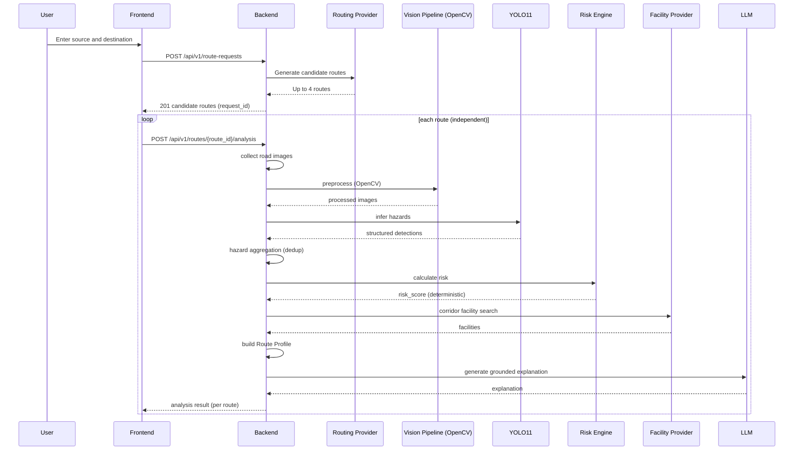

# 07_API_CONTRACT.md — SafeRoute AI API Contract

**Project:** SafeRoute AI — Intelligent Road Safety Navigation System
**Document:** Authoritative API Contract Specification
**Version:** 1.0
**Status:** Implementation-Ready
**Authority:** `MASTER_RULES.md` > `01_PRD.md` > `02_TRD.md` > `03_ARCHITECTURE.md` > `04_DATA_MODEL.md` > this document
**Companion:** `docs/API.md` (operational API documentation per `02_TRD.md` §152)

---

## 1. PROJECT CONTEXT

**Core function:** user provides **source** + **destination**; the system generates up to 4 candidate routes, analyzes them (imagery → OpenCV → YOLO11 → hazard aggregation → deterministic risk), finds nearby facilities, builds a Route Profile, and uses an LLM **only** to explain verified results.

**Architecture rule (non-negotiable):**
- Routing generates candidate routes; SafeRoute AI evaluates them.
- The LLM **never** generates authoritative routes, detects hazards, calculates the authoritative risk score, invents facilities, or modifies numerical analysis.

**API contract covers agreement between:** Frontend ↔ Backend ↔ Routing Provider, Road Image Pipeline, OpenCV, YOLO11, Hazard Aggregation, Risk Engine, Facility Engine, Route Analysis Engine, LLM Layer, Database, Authentication, and Admin/Monitoring (where applicable).

---

## 2. DOCUMENT AUTHORITY & CONSISTENCY

This contract is consistent with PRD, TRD, Architecture, Data Model, and Data Sources. It does not invent requirements absent from those documents.

**Conflict handling:**
1. Identify the conflict (do not silently choose).
2. Follow the higher-level authoritative document.
3. Record the conflict.
4. Mark unresolved decisions as `[DECISION REQUIRED]`.

---

## 3. API DESIGN PRINCIPLES

Predictable ⋅ Versioned ⋅ Consistent ⋅ Explicit ⋅ Secure ⋅ Validated ⋅ Observable ⋅ Testable ⋅ Backward-compatible ⋅ Machine-readable ⋅ Frontend-friendly ⋅ ML-pipeline-friendly ⋅ Failure-aware.

**Prohibitions:**
- Random endpoint naming, inconsistent responses, hidden side effects, duplicate endpoints.
- Business logic inside controllers.
- LLM-generated authoritative values.
- Returning internal DB structures directly.
- Leaking secrets or provider-specific implementation details.

---

## 4. API VERSIONING

- **Pattern:** `/api/v1/{resource}`.
- **Version format:** `v{n}` (major only; breaking → new major version).
- **Policy:** additive changes are backward-compatible within a version; breaking changes require a new version + documented migration.
- **Deprecation:** deprecated endpoints marked `Deprecated: true` in OpenAPI, supported at least one minor cycle alongside the successor.
- **Base URL (dev/examples):** `http://localhost:8000/api/v1`.

---

## 5. API RESOURCE MODEL

Canonical resources (only those justified by PRD/TRD/Data Model are implemented):

| # | Resource | Endpoint(s) |
|---|----------|-------------|
| 1 | RouteRequest | `POST /api/v1/route-requests` |
| 2 | Route | `GET /api/v1/route-requests/{request_id}/routes`, `GET /api/v1/routes/{route_id}` |
| 3 | RouteSegment | `GET /api/v1/routes/{route_id}/segments` |
| 4 | RoadImage | `GET /api/v1/routes/{route_id}/images` |
| 5 | Hazard (aggregated) | `GET /api/v1/routes/{route_id}/hazards` |
| 6 | HazardDetection | `GET /api/v1/routes/{route_id}/detections` |
| 7 | RiskAnalysis | `GET /api/v1/routes/{route_id}/risk` |
| 8 | Facility | `GET /api/v1/routes/{route_id}/facilities`, `.../facilities/summary` |
| 9 | RouteAnalysis | `POST /api/v1/routes/{route_id}/analysis`, `GET /api/v1/routes/{route_id}/analysis` |
| 10 | AnalysisJob | `GET /api/v1/jobs/{job_id}` |
| 11 | LLMExplanation | `POST /api/v1/llm/explanations` |
| 12 | Health/Status | `GET /api/v1/health` |
| 13 | ModelVersion | Admin/internal (not public) |

Not exposed publicly (internal pipeline only): OpenCV, YOLO11 raw inference, Risk Engine internals.

---

## 6. CORE ROUTE WORKFLOW

```
CLIENT → POST /api/v1/route-requests
  → validate source/destination
  → routing provider → normalize provider response
  → create 1–4 candidate routes → return route info
  → POST /api/v1/routes/{route_id}/analysis (per route, up to 4)
  → road image pipeline → OpenCV → YOLO11 → hazard aggregation
  → Risk Engine → Facility Engine → Route Analysis
  → LLM explanation
  → Frontend renders
```

---

## 7. ENDPOINT SPECIFICATIONS

### 7.1 POST /api/v1/route-requests

Create a route request; generates up to 4 candidate routes.

**Request**

```json
{
  "source": { "latitude": 12.9716, "longitude": 77.5946, "name": null, "place_id": null },
  "destination": { "latitude": 12.9352, "longitude": 77.6245, "name": null, "place_id": null }
}
```

No additional user preferences in v1 (not required by PRD/TRD).

**Validation**
- `latitude ∈ [-90, 90]`, `longitude ∈ [-180, 180]` (check + schema). Missing/empty/malformed JSON → `VALIDATION_ERROR` / `INVALID_COORDINATES`.
- Unknown extra fields → rejected.

**Success — `201 Created`**

```json
{
  "request_id": "req_123",
  "status": "completed",
  "count": 3,
  "routes": [
    {
      "route_id": "route_1",
      "route_index": 0,
      "distance_meters": 8200,
      "duration_seconds": 1140,
      "geometry": { "type": "LineString", "coordinates": [[77.59, 12.97], [77.62, 12.94]] },
      "status": "available"
    }
  ]
}
```

- `count` = actual number of routes available (0–4). **Never fabricate routes to reach four.**
- **Canonical units:** distance = meters, duration = seconds. Frontend MAY convert to km/minutes.

**Failure — `502`** `ROUTING_PROVIDER_ERROR` or `422` `INVALID_COORDINATES`; **`404`** with `NO_ROUTE_FOUND` when zero routes exist.

**Side effects:** persists `route_request` + `routes` + `route_segments` (atomic transaction, `04_DATA_MODEL.md` §7.2–7.5).

**Idempotency:** repeated POST with identical coordinates creates a new request (no idempotency key required for v1; caching dedupes identical recent requests server-side optionally).

### 7.2 GET /api/v1/routes/{route_id}

Returns one normalized route.

```json
{
  "route_id": "route_1",
  "request_id": "req_123",
  "route_index": 0,
  "distance_meters": 8200,
  "duration_seconds": 1140,
  "geometry": { "type": "LineString", "coordinates": [[...], [...]] },
  "status": "available"
}
```

Errors: `404 ROUTE_NOT_FOUND`, `400 INVALID_REQUEST`.

### 7.3 GET /api/v1/route-requests/{request_id}/routes

Lists all candidate routes for a request (pagination optional; ≤4 so not paginated).

```json
{
  "request_id": "req_123",
  "count": 3,
  "routes": [ ... ]
}
```

### 7.4 GET /api/v1/routes/{route_id}/segments

Segments in route order.

```json
{
  "route_id": "route_1",
  "segments": [
    { "segment_id": "segment_1", "sequence": 0,
      "geometry": { "type": "LineString", "coordinates": [[...], [...]] },
      "length_meters": 420 }
  ]
}
```

### 7.5 Geometry Contract (single canonical format)

- **Format:** GeoJSON `LineString`.
- **Coordinate order:** `[longitude, latitude]` (GeoJSON standard). **Never mix conventions across endpoints.**
- **CRS:** EPSG:4326 (WGS84).
- **Serialization:** `jsonb`; validated at API boundary (`02_TRD.md` §116).
- **Precision:** full double; truncate only for display.

### 7.6 POST /api/v1/routes/{route_id}/analysis

Start analysis of one route. If synchronous execution is feasible (v1 default for small batches), returns the completed analysis; otherwise returns a job (see 7.8).

**Request**

```json
{ "include_hazards": true, "include_facilities": true, "include_llm_explanation": true }
```

(Flags only if the architecture supports them; else omit.)

**Synchronous — `200`:** full Route Analysis object (§10).
**Async — `202 Accepted`:**

```json
{ "job_id": "job_123", "route_id": "route_1", "status": "queued" }
```

- Analysis is expensive; batch is async when cost threshold exceeded (`02_TRD.md` §82).
- Idempotency: `POST` with `Idempotency-Key` header re-runs or returns existing job per stored key.

### 7.7 GET /api/v1/jobs/{job_id}

Poll job status. Stages exposed only if actually implemented (`02_TRD.md` §84/§23).

```json
{
  "job_id": "job_123",
  "route_id": "route_1",
  "status": "processing",
  "stage": "YOLO_INFERENCE",
  "completed_at": null,
  "error": null
}
```

`status ∈ queued | processing | completed | partial | failed | cancelled`. Do **not** invent progress percentages the backend cannot compute.

### 7.8 GET /api/v1/routes/{route_id}/images

Images for a route (paginated, cursor).

```json
{
  "route_id": "route_1",
  "next_cursor": null,
  "images": [
    {
      "image_id": "image_1",
      "segment_id": "segment_1",
      "latitude": 12.95,
      "longitude": 77.6,
      "source": "imagery_provider",
      "captured_at": "2026-09-01T10:00:00Z",
      "processing_status": "analyzed",
      "quality_status": "ok"
    }
  ]
}
```

- Never expose private storage paths (`file_reference` is internal-only).

### 7.9 POST /api/v1/images (upload, only if uploads enter scope)

If user/provider image uploads are accepted (PRD allows imagery from permitted sources):

```json
{
  "route_id": "route_1",
  "segment_id": "segment_1",
  "latitude": 12.95,
  "longitude": 77.6,
  "captured_at": "2026-09-01T10:00:00Z",
  "image": "<multipart file>"
}
```

**Validation:** MIME type, extension, file size (`IMAGE_MAX_SIZE`), image decode, dimensions; never trust extension alone. Malware/safety checks, authorization required, storage policy per `02_TRD.md` §76–§77.

**Errors:** `400 VALIDATION_ERROR`, `413 IMAGE_TOO_LARGE`, `403 FORBIDDEN`.

### 7.10 GET /api/v1/routes/{route_id}/hazards

Aggregated (unique physical) hazards.

```json
{
  "route_id": "route_1",
  "status": "completed",
  "hazards": [
    { "hazard_id": "hazard_1", "type": "pothole",
      "latitude": 12.95, "longitude": 77.60,
      "severity": 0.9, "confidence_summary": 0.91, "detection_count": 3 }
  ]
}
```

- Severity is a project-defined analytic value — never present it as official/medical/legal.
- Safety unavailable → `{ "status": "unavailable" }`, never fake counts.

### 7.11 GET /api/v1/routes/{route_id}/detections

Raw YOLO detections (rarely used; diagnostics).

```json
{
  "route_id": "route_1",
  "detections": [
    { "detection_id": "det_1", "image_id": "image_1", "segment_id": "segment_1",
      "type": "pothole", "confidence": 0.91,
      "bounding_box": { "x1": 120, "y1": 80, "x2": 310, "y2": 240 },
      "model_version": "v1.0" }
  ]
}
```

Payload MUST clarify: **a detection is not necessarily a unique physical hazard.**

### 7.12 GET /api/v1/routes/{route_id}/risk

```json
{
  "route_id": "route_1",
  "risk": { "score": 28, "scale": "0-100", "algorithm_version": "v1",
             "status": "calculated" }
}
```

- The Risk Engine is authoritative for `score`. Never describe as government/universal safety standard (`MASTER_RULES.md` §13).
- Failure → `{ "risk": { "status": "unavailable" } }` — **never substitute `score: 0`** for failed calculation.

### 7.13 GET /api/v1/routes/{route_id}/facilities

Category filter: `?category=hospital`

```json
{
  "route_id": "route_1",
  "facilities": [
    { "facility_id": "facility_1", "name": "Example Hospital", "category": "hospital",
      "latitude": 12.95, "longitude": 77.60,
      "distance_from_route_meters": 800,
      "distance_metric": "straight_line" }
  ]
}
```

- `distance_metric` MUST be explicit; never call straight-line distance "driving distance".
- Unknown category → `422 VALIDATION_ERROR`.

### 7.14 GET /api/v1/routes/{route_id}/facilities/summary

```json
{
  "route_id": "route_1",
  "status": "completed",
  "hospitals": { "count": 3, "nearest_distance_meters": 800 },
  "medical_stores": { "count": 7, "nearest_distance_meters": 200 },
  "restaurants": { "count": 15, "nearest_distance_meters": 100 },
  "hotels": { "count": 5, "nearest_distance_meters": 600 },
  "petrol_pumps": { "count": 2, "nearest_distance_meters": 900 },
  "police_stations": { "count": 1, "nearest_distance_meters": 1200 }
}
```

- `count: 0` = provider returned zero after a successful search.
- Provider failure → `{ "status": "unavailable" }` (never zero, never fabricated).

### 7.15 GET /api/v1/routes/{route_id}/analysis

Canonical combined Route Profile (§10). Errors: `404 ROUTE_NOT_FOUND`.

### 7.16 POST /api/v1/llm/explanations

**Input MUST reference verified analysis**, not arbitrary client values:

```json
{ "route_analysis_id": "analysis_123" }
```

**Response**

```json
{
  "explanation_id": "exp_123",
  "route_id": "route_1",
  "text": "Route 1 is 8.2 km with an estimated travel time of 19 minutes. The analyzed road imagery contained detected potholes and road cracks. Three hospitals were found within the configured route corridor.",
  "model": "llm-model-x",
  "prompt_version": "v1",
  "generated_at": "2026-09-22T18:30:00Z"
}
```

- Response is **generated** data, never the source of truth.
- Grounding rule: backend builds the prompt from verified structured data; the client may never submit risk scores/hazard counts/facility counts as authoritative input.
- LLM unavailable → backend returns deterministic fallback text with `"fallback": true`.

### 7.17 GET /api/v1/health

```json
{ "status": "ok" }
```

Optional detailed health only behind authorization:
```json
{ "status": "ok", "database": "healthy", "model": "loaded" }
```
Never expose infrastructure/secrets publicly (`02_TRD.md` §122, §158).

---

## 8. AUTHENTICATION & AUTHORIZATION

- **v1 PRD has no user accounts.** Auth endpoints (`/register`, `/login`, `/refresh`) are **NOT** added. `[DECISION REQUIRED]` if auth enters scope later.
- **Authorization levels:**

| Area | Level |
|------|-------|
| Route generation/analysis/facilities/LLM | Public (v1) |
| Image upload | Public + rate-limited (validated) |
| Model management, system config | Admin/Internal (API key) |
| YOLO inference / Risk Engine / facility adapter | Internal only |

- **Internal ≠ public:** the frontend never calls internal ML/risk services directly (`02_TRD.md` §7, §38).
- Secrets: admin keys via `Authorization: Bearer <key>` from env/secrets manager; never in code, logs, or responses.

---

## 9. ERRORS

### 9.1 Error Response Contract (all endpoints)

```json
{
  "error": {
    "code": "ROUTE_NOT_FOUND",
    "message": "No route was found for the requested locations.",
    "details": null,
    "request_id": "req_123"
  }
}
```

- Never expose stack traces. `request_id` echoes `X-Request-ID` (or backend-generated).

### 9.2 Error-Code Catalogue (only what is actually supported)

```
VALIDATION_ERROR          400/422
INVALID_COORDINATES       422
INVALID_REQUEST           400
IMAGE_TOO_LARGE           413
UNAUTHORIZED              401
FORBIDDEN                 403
NOT_FOUND / ROUTE_NOT_FOUND  404
NO_ROUTE_FOUND            404
ROUTING_PROVIDER_ERROR    502
IMAGE_NOT_AVAILABLE       503
IMAGE_PROCESSING_FAILED   500
YOLO_INFERENCE_FAILED     500
HAZARD_ANALYSIS_FAILED    500
RISK_CALCULATION_FAILED   500
FACILITY_PROVIDER_ERROR   502
LLM_PROVIDER_ERROR        502
ANALYSIS_TIMEOUT          504
RATE_LIMITED              429
INTERNAL_ERROR            500
```

### 9.3 HTTP Status Codes

`200` success, `201` created, `202` accepted (async), `204` no content, `400` bad request, `401` unauthorized, `403` forbidden, `404` not found, `409` conflict, `422` validation, `429` rate limited, `500`, `502`, `503`, `504`. **Never use 200 for failures.**

### 9.4 Partial Success

Communicated explicitly via nested `status` fields; never `score: 0` for failed risk, never empty arrays for provider failure (`02_TRD.md` §140–§141):

```json
{
  "analysis": {
    "status": "partial",
    "safety": { "status": "unavailable" },
    "facilities": { "status": "completed" }
  }
}
```

---

## 10. ROUTE PROFILE — SEPARATION CONTRACT

`GET /api/v1/routes/{route_id}/analysis` MUST keep domains separate. **No combined "overall score"** mixing hazards + facilities unless explicitly approved.

```json
{
  "route_id": "route_1",
  "route": { "distance_meters": 8200, "duration_seconds": 1140 },

  "safety": {
    "risk": { "score": 28, "scale": "0-100", "status": "calculated" },
    "hazards": { "potholes": 3, "road_cracks": 2, "obstacles": 1 },
    "images_analyzed": 15,
    "segments_analyzed": 24,
    "status": "completed"
  },

  "facilities": {
    "status": "completed",
    "hospitals": { "count": 3, "nearest_distance_meters": 800 },
    "medical_stores": { "count": 7, "nearest_distance_meters": 200 },
    "restaurants": { "count": 15, "nearest_distance_meters": 100 },
    "hotels": { "count": 5, "nearest_distance_meters": 600 },
    "petrol_pumps": { "count": 2, "nearest_distance_meters": 900 },
    "police_stations": { "count": 1, "nearest_distance_meters": 1200 }
  },

  "analysis": { "status": "completed", "started_at": "...", "completed_at": "..." },

  "explanation": { "explanation_id": "exp_123", "text": "...", "fallback": false }
}
```

---

## 11. CONVENTIONS

### 11.1 Field Naming
- JSON: **snake_case** everywhere (`route_id`, `distance_meters`, `created_at`). No mixed casing.

### 11.2 Dates/Times
- ISO 8601 UTC with `Z` suffix: `2026-09-22T18:30:00Z`. Never ambiguous local time.

### 11.3 Null vs Absent vs Zero vs Unavailable

| State | Representation | Meaning |
|-------|----------------|---------|
| Absent | field omitted | not applicable |
| Null | `null` | explicitly unknown/not measured |
| Zero | `0` | measured value is zero |
| Empty array | `[]` | successfully queried, none found |
| Unavailable | `{"status":"unavailable"}` | provider/pipeline failed; not fabricated |

### 11.4 Pagination
- Cursor-based for collections (images, detections, facilities, analysis history): `{ "items": [...], "next_cursor": "..." }` with `?limit=` (default 20, max 100). Small fixed summaries ≤4 (routes, facility summary) are not paginated.

### 11.5 Filtering
- Documented filters only: `category` (facilities), `hazard_type`, `status`, `segment_id`, `date_from`/`date_to`. Unknown filters → `422`.

### 11.6 Sorting
- `sort_by` + `order` only for documented, validated fields (e.g. `created_at`). Never accept arbitrary DB column names.

### 11.7 Idempotency
- Expensive POSTs (`analysis`, image upload, LLM explanation) accept `Idempotency-Key`; server reuses stored result for the same key until TTL, else runs once.

### 11.8 Request ID & Rate Limiting
- `X-Request-ID`: client may send; backend generates if absent. Returned in all responses/errors.
- Rate limiting on expensive endpoints (route generation, analysis, image upload, LLM) → `429 RATE_LIMITED` with `Retry-After`.

---

## 12. PROVIDER ABSTRACTION

Public API consumes only canonical, provider-agnostic models:

```
Routing Provider A / B → Provider Adapter → Canonical Route Model → Public API
Facility Provider A / B → Facility Adapter → Canonical Facility Model → Public API
LLM Provider            → LLMService        → Canonical Explanation  → Public API
```

Provider metadata (if exposed): `provider`, `provider_resource_id`, `provider_timestamp`. **Never** expose credentials, private paths, or SDK details (`02_TRD.md` §93–§95, §52–§53).

---

## 13. API SECURITY

- Input validation (schema + range checks), authentication/authorization where enabled, rate limiting, CORS policy (restrict to allowed frontend origins), request size limits, file validation on uploads, output sanitization, injection protection, secret handling via env/secrets manager.
- Never expose: API keys, DB passwords, JWT signing secrets, provider credentials, internal file paths, stack traces.

---

## 14. SCHEMAS & OPENAPI

- All endpoints defined by typed Pydantic schemas; FastAPI auto-generates **OpenAPI 3.x** (`/docs`, `/openapi.json`).
- Authoritative machine-readable spec: the generated **OpenAPI JSON** in the repo (e.g. `docs/openapi.json`). This document (07_API_CONTRACT.md) is the human-authored contract and MUST match it — do not maintain conflicting definitions (`02_TRD.md` §152).

---

## 15. API FLOW DIAGRAM



---

## 16. REQUEST/RESPONSE EXAMPLES (labeled EXAMPLE/MOCK values)

Covered inline above for: route request (7.1), route response (7.1/7.2), segments (7.4), analysis start (7.6), job status (7.7), images (7.8), hazards (7.10), facilities (7.13/7.14), risk (7.12), route profile (§10), LLM explanation (7.16), error (§9.1), partial analysis (§9.4). All numbers are **examples only** and must never be presented as real production measurements (`02_TRD.md` §151).

---

## 17. RELATIONSHIP TO OTHER DOCUMENTS

- `02_TRD.md` §49–§58 (authoritative endpoint/validation baseline)
- `04_DATA_MODEL.md` (entities serialized by these endpoints)
- `05_DATA_SOURCES.md` (providers behind adapters)
- `09_ERROR_HANDLING.md` (failure states/recovery)
- `10_SECURITY.md` (auth, rate limits, input validation)
- `13_TESTING.md` (API test cases per `02_TRD.md` §112)
- `docs/API.md` (operational documentation)

---

# END OF API CONTRACT