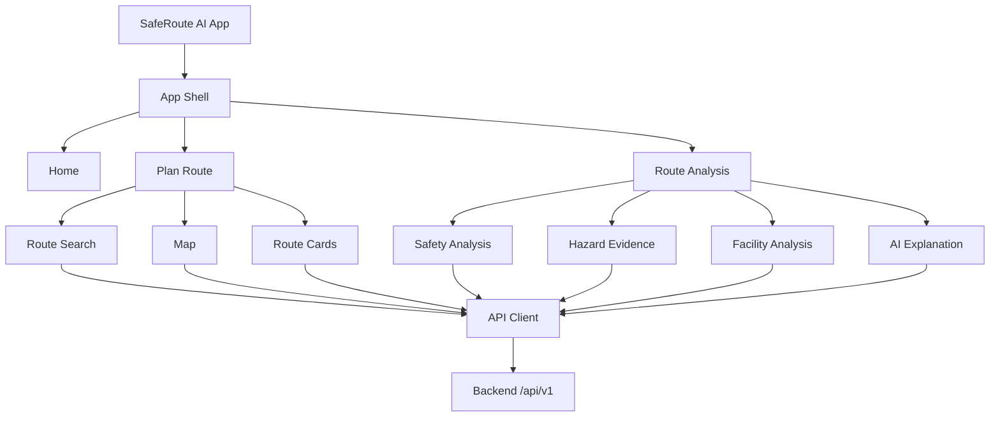

# 08_UI_SPEC.md — SafeRoute AI UI Specification

**Project:** SafeRoute AI — Intelligent Road Safety Navigation System
**Document:** Authoritative UI/UX Specification
**Version:** 1.0
**Status:** Implementation-Ready
**Authority:** `MASTER_RULES.md` > `01_PRD.md` > `02_TRD.md` > `03_ARCHITECTURE.md` > `07_API_CONTRACT.md` > this document
**Companion:** `docs/API.md`, frontend `src/types` mirroring `07_API_CONTRACT.md` schemas

---

## 1. PURPOSE

This document is the single authoritative specification for the SafeRoute AI frontend: visual identity, design system, layout, navigation, screens, components, user flows, map behavior, states, responsive behavior, accessibility, interaction/animation rules, frontend architecture, and state management.

**Golden requirement:** the UI must make the decision-making workflow obvious and never hide verified data behind an opaque "AI recommended route".

---

## 2. GOLDEN UI PRINCIPLE

```
USER → Enter Source + Destination → Generate Candidate Routes
→ View Up To 4 Routes → Select Route → Analyze Route
→ View Road Safety → View Nearby Facilities → View Route Evidence
→ Read AI Explanation → User Makes Their Own Route Choice
```

The interface presents **facts** (route, hazards, risk, facilities) with the LLM explanation clearly subordinate (`02_TRD.md` trust hierarchy §168, §123 here).

### Core Principles
Clear ⋅ Modern ⋅ Professional ⋅ Trustworthy ⋅ Minimal ⋅ Data-driven ⋅ Accessible ⋅ Responsive ⋅ Fast ⋅ Consistent ⋅ Explainable ⋅ Evidence-oriented.

**Forbidden:** excessive decoration/gradients/animation, fake AI effects, 3D clutter, tiny critical text, misleading safety claims, fabricated statistics/counts, hiding unavailable data as zero.

---

## 3. AUTHORITY & CONFLICT

- This spec is authoritative for UI behavior.
- MASTER_RULES > PRD > TRD > Architecture > API Contract take precedence on conflict.
- On conflict: identify it, follow the higher document, and mark the decision `[DECISION REQUIRED]`. Never choose silently.

---

## 4. DESIGN LANGUAGE

Visual identity communicates: **Navigation, Safety, Technology, Reliability, Data, Clarity.**

The product is a *Navigation + Road Safety Intelligence Platform* — not a chatbot, gaming/crypto dashboard, social app, or medical app.

---

## 5. DESIGN SYSTEM

### 5.1 Color tokens (semantic; never raw colors in components)

```
--color-primary            /* brand, primary actions */
--color-primary-hover
--color-primary-active
--color-background
--color-surface
--color-surface-elevated
--color-text-primary
--color-text-secondary
--color-text-muted
--color-border
--color-success
--color-warning
--color-danger
--color-info
--color-focus-ring
```

### 5.2 Safety color semantics (visual hierarchy only)

| Risk band (project scale 0–100) | Token |
|---------------------------------|-------|
| 0–33 | success |
| 34–66 | warning |
| 67–100 | danger |

- Thresholds are the project's own analytic definition — display as **"Risk: 28 / 100"**, never "100% Safe", "Completely Safe", "Guaranteed Safe", or "Accident Proof" (`MASTER_RULES.md` §13, `02_TRD.md` §138).
- Risk value is **always shown with its scale** (e.g. `28 / 100`), and color alone is never the only signal.

### 5.3 Facility category colors/icons (consistent across map, cards, legend, lists, detail)

| Category | Marker/icon semantic |
|----------|----------------------|
| hospital | distinct color + icon |
| medical_store | distinct |
| restaurant | distinct |
| hotel | distinct |
| petrol_pump | distinct |
| police_station | distinct |
| hazard (per class) | set of hazard icon semantics |

Same concept = same color/icon everywhere. Never change category colors between screens.

### 5.4 Typography

- Primary font with system fallbacks (e.g. `Inter`, `-apple-system`, `Segoe UI`, `Roboto`, sans-serif).
- Hierarchy: `H1, H2, H3, H4, Body, Small, Caption, Button, Label`.
- Critical safety data (risk score, hazard counts) uses Body/H3 at minimum — never Caption-size.
- Readable on desktop, tablet, mobile.

### 5.5 Spacing scale

`4, 8, 12, 16, 20, 24, 32, 40, 48, 64` — no arbitrary values unless necessary.

### 5.6 Radius / shadows / elevation / z-index

- Radius tokens: `sm, md, lg, full`.
- Shadow/elevation tokens for surface, surface-elevated, modals, toasts.
- z-index scale (tokenized, no magic numbers): map < routes < markers < controls < panels < dropdowns < modals < toasts.

### 5.7 Icons

One consistent icon library (per TRD frontend decision). Required icon set: source, destination, route, each facility category, each hazard class (pothole, road_crack, damaged_road, obstacle, debris), warning, success, error, info. No mixed second icon library.

### 5.8 Buttons / Inputs / Cards / Badges / Tables / Charts / Map overlays

- Button variants: primary, secondary, tertiary, danger, icon-only; states: default/hover/focus/active/disabled/loading.
- Form system: text, search, select, autocomplete, checkbox, radio, toggle — every control has a label, focus state, validation state, accessible name.
- Cards: surface, consistent padding (16), radius (md), border.
- Badges for category/status; tables for route comparison; charts only when they aid comprehension (hazard breakdown, risk breakdown); map overlays styled by tokens.

---

## 6. LAYOUT & NAVIGATION

### 6.1 App shell

```
┌─────────────────────────────────────────┐
│ Header / Navigation                     │
├───────────────────┬─────────────────────┤
│                   │                     │
│ Map               │ Route / Analysis    │
│ (primary area)    │ Panel (cards + det  │
│                   │ )                   │
└───────────────────┴─────────────────────┘
```

### 6.2 Navigation items (only approved pages)

Home, Plan Route, Route Analysis, About. (History/Settings only if PRD/TRD later require them.)

### 6.3 Frontend routes (approved)

```
/                        Home
/plan                    Route search + overview
/routes/{route_id}       Route detail
/routes/{route_id}/analysis  Route analysis (map + safety + facilities + AI)
```

Deep link `/[routes/{route_id}]/analysis` restores state; handle expired/deleted/unavailable gracefully (§21).

---

## 7. HOME PAGE

1. Header 2. Hero 3. Source/Destination search 4. What SafeRoute AI does 5. How analysis works 6. Feature overview (up to 4 routes) 7. Safety analysis explanation 8. Facility intelligence 9. Technology section 10. CTA 11. Footer.

Explains plainly; no unsupported claims; no fake statistics.

---

## 8. ROUTE SEARCH UI

- Fields: `Source`, `Destination` (+ swap, clear; current-location only if supported).
- Component supports autocomplete, loading, validation, error, empty suggestions, keyboard navigation.
- Never exposes provider-specific APIs to the user; submits to `POST /api/v1/route-requests`.
- Validation messages (understandable): empty source, empty destination, invalid coordinates, same source/destination.

### Route generation flow

1. Validate → 2. block duplicate submit → 3. loading → 4. call API → 5. render **actual** number of routes (1–4) dynamically → 6. never fabricate routes. UI adapts to any count.

---

## 9. ROUTE OVERVIEW

Required: map, route list/cards, distance, duration, safety status, facility status. All available routes stay visible (never auto-hide unless explicitly selected flow).

Route cards (dynamic, up to 4, never hard-coded "Route A/B"):

```
┌──────────────────────────────┐
│ Route 1                      │
│ 8.2 km • 19 min              │
│ Risk Score: 28 / 100         │
│ Hazards: 6 | Hospitals: 3    │
│ [View Analysis]              │
└──────────────────────────────┘
```

Card hierarchy: route identity → distance/duration → safety status (risk) → facility counts → action. States: default, selected, hover, focus, loading, unavailable, disabled.

---

## 10. MAP UI

- Features: source marker, destination marker, up to 4 route polylines, selected-route emphasis, hazard markers, facility markers, zoom, fit bounds, category toggles, legend.
- Route lines are visually distinguishable (thickness, opacity, selection state, labels) — **never rely on color alone**.
- Selected route prominent; others visible but subdued.
- **Clustering + viewport filtering** for large marker sets; expansion is intuitive; no marker overload.
- Legend lists: routes, selected route, each hazard class, each facility category.

### Hazard markers/details
Marker shows type + confidence; popup shows type, confidence, location, route/segment, image evidence when available. Clearly label Detected vs Estimated vs Unavailable. Hazard detail opens an image viewer with bounding box, image metadata, prev/next/close/zoom.

### Facility markers/details
Card shows: name, category, distance from route, address/phone/status **only if the API returns them**. Filter toggles: hazards + each facility category.

---

## 11. SAFETY DASHBOARD

Sections: risk score, hazard summary, hazard density, hazard types, images analyzed, segments analyzed, model information (where useful).

```
ROAD SAFETY
Risk Score
28 / 100          ← always with scale, semantic color band
Detected Hazards
Potholes    3
Road Cracks 2
Obstacles   1
```

Hazard breakdown uses the simplest visualization that communicates (bars/cards/icons). Never imply an official universal safety standard.

---

## 12. FACILITY INTELLIGENCE UI

**Structurally separated from road safety** (`MASTER_RULES.md` §14):

- **Emergency Accessibility:** hospitals, medical stores, police stations.
- **Travel Convenience:** restaurants, hotels, petrol pumps.

No combined "safety score" mixing hazard counts with facility counts. Facility summary shows count + nearest distance from `facilities/summary`:

```
Hospitals       3 nearby   Nearest: 0.8 km
Medical Stores  7 nearby   Nearest: 0.2 km
Police Stations 1 nearby   Nearest: 1.2 km
```

---

## 13. ROUTE DETAIL / ANALYSIS PAGE

Structure (map stays prominent):

```
Route Header → Map → Route Summary → Safety Analysis → Hazard Evidence
→ Facility Analysis → Route Metrics → AI Explanation
```

### AI Explanation UI
- Label: **"AI Analysis"** / **"Route Explanation"**.
- Displays grounded text from `POST /api/v1/llm/explanations` (or backend fallback).
- Accompanied by: `"AI-generated explanation based on route analysis data."`
- Must not visually imply more authority than the structured data it explains (`02_TRD.md` §168).
- LLM output is **untrusted text**: render as plain text / sanitized markdown — never unsafe HTML.

### Traceability
Where useful, expose risk data, hazard evidence, facility data, analysis timestamp, model version (transparency); label data sources: "Road Hazard Analysis — based on analyzed road imagery", "Facility Data — source: configured facility provider", "AI Explanation — generated from SafeRoute AI analysis data".

---

## 14. STATES

### 14.1 Global state model

`INITIAL | LOADING | SUCCESS | PARTIAL | EMPTY | ERROR | UNAVAILABLE`

Use explicit states (state machine), not boolean piles (`isLoading && !hasError ...`).

### 14.2 Route analysis state mapping

`NOT_STARTED | QUEUED | PROCESSING | PARTIAL | COMPLETED | FAILED` ← maps backend job statuses explicitly.

### 14.3 Loading states

- Skeletons/spinners/progress for: location search, route generation, map, images, hazard analysis, facility search, risk, LLM.
- **No fake progress percentages.** If async analysis runs, show real stages from job status:
  `✓ Route generated → ✓ Images collected → ✓ Images processed → ● Hazard detection → ○ Risk → ○ Facilities → ○ AI explanation`.

### 14.4 Empty states (accurate wording)

- No routes: "Enter a source and destination to generate routes."
- No hazards: "No hazards were detected in the analyzed imagery." (never "completely safe")
- No facilities: "No facilities were found within the configured search area."
- Empty map: guidance message, not a blank map.

### 14.5 Error states

Explain *what happened* and *what the user can do*: route generation failed (Retry, Edit locations), facility provider unavailable, image unavailable, hazard analysis failed, LLM unavailable, network, auth (if any).

### 14.6 Unavailable vs Zero (CRITICAL, visually distinct)

| State | Copy | Meaning |
|-------|------|---------|
| ZERO | "0 hospitals found" | search completed, zero results |
| UNAVAILABLE | "Hospital data unavailable" | data could not be obtained |

**Never render unavailable as zero.** `{ "status": "unavailable" }` renders as unavailable UI.

### 14.7 Not analyzed vs no hazards

- "Safety Analysis — **Not analyzed yet**" (no analysis performed)
- "Safety Analysis — **0 hazards detected**" (analyzed, none found)

### 14.8 Partial analysis

Never hide the whole route because one subsystem failed:

```
Route:  available
Safety: available
Facilities: unavailable  → "Facility information is currently unavailable."
AI explanation: available based only on available data / "AI explanation is currently unavailable."
```

### 14.9 Failure states (never mask with zero)

- Analysis failure → "Safety analysis could not be completed." + **Retry Analysis** (never `risk_score = 0`).
- LLM failure → show structured analysis normally; explanation area shows unavailable message.

---

## 15. COMPONENTS / NOTIFICATIONS / MODALS / DRAWERS

- **Toasts:** success/warning/error/info for transient feedback only. Never for critical safety info users may miss.
- **Modals:** confirmation, detailed evidence, important actions only — never the whole app inside a modal.
- **Drawers/bottom sheets:** mobile route/facility details; side panel on desktop. Same information architecture.
- Keyboard usable; correct focus management for modals; Escape closes; focus returns to trigger.

---

## 16. ACCESSIBILITY (WCAG-oriented)

- Keyboard navigation (header, search, route cards, filters, map controls where possible, dialogs), visible focus, semantic HTML, accessible labels, ARIA where appropriate, sufficient contrast, screen-reader support, touch-friendly targets, **no color-only meaning** — critical safety data never relies on color alone.
- Respect `prefers-reduced-motion`.
- Mobile touch targets ≥ 44px for controls/markers/filters/close buttons.
- Responsive breakpoints: mobile / tablet / desktop / large desktop. Components adapt (not just shrink). Desktop: map primary + side panel; tablet: info below map; mobile: vertical route cards, bottom sheet details, touch controls reachable.

---

## 17. UNITS, FORMATTING & API MAPPING

- API internal units (never modified in UI): `distance_meters`, `duration_seconds`.
- Display: `8200 m → 8.2 km`; `1140 s → 19 min`; `risk.score → 28 / 100`; `facilities.hospitals.count → 3 hospitals`.
- Centralized formatting utilities — consistent across screens, no per-component drift.

---

## 18. MAP & UI STATE MANAGEMENT

- State: `selectedRoute, visibleRoutes, visibleHazardTypes, visibleFacilityTypes, mapCenter, zoom, selectedHazard, selectedFacility, analysisJobs`.
- No duplicate state; derive where possible.
- URL state: `route_id`, `analysis_id`, selected category — via router params/query (no sensitive data in URLs).

---

## 19. FRONTEND ARCHITECTURE

```
API (07_API_CONTRACT)
   → api/ client (typed, snake_case schemas)
   → data transformation (meters→km etc.)
   → state management
   → UI components (presentational, one responsibility)
```

- Components never query providers directly, never compute risk, never hold business logic (`02_TRD.md` §7).
- `Component responsibility`: RouteCard displays a summary — it does not calculate risk or query facilities.
- App-level error boundary: unexpected failures → recoverable state (Retry / Reload / Return to route / debug info).

Recommended structure (adapt to framework — React + Vite + TS):

```
src/
  components/            /* RouteCard, MapView, HazardMarker, FacilityMarker, ... */
  pages/                 /* Home, PlanRoute, RouteAnalysis, RouteDetails */
  layouts/
  features/{routes,hazards,facilities,analysis,map}/
  hooks/  services/  api/  state/  utils/  styles/  types/
```

Naming: `RouteCard`, `RouteMap`, `HazardMarker`, `FacilityMarker`, `RiskScoreCard`, `AnalysisProgress`, `AIExplanationCard`. No vague names (`Box`, `Thing`, `Section2`).

---

## 20. PERFORMANCE

- Map rendering, polylines, marker sets, images, charts optimized: lazy rendering, memoization, viewport filtering, marker clustering, image optimization (thumbnails instead of originals), caching.
- No premature optimization; measure first.

---

## 21. UI TESTING

- Component/interaction tests: route search, cards, selection, map rendering, hazard/facility filtering, risk display, loading/error/partial/empty states, responsive behavior, keyboard navigation, accessibility.
- Visual regression for critical screens (Home, Route overview, Analysis, Mobile route screen) if tooling added.
- Accessibility checks: keyboard, focus, contrast, labels, screen-reader semantics, reduced motion, touch targets.
- **Security tests:** XSS / unsafe HTML / untrusted LLM output / malicious facility or route names / unsafe URLs; LLM content always treated as untrusted text.

---

## 22. AI CODING AGENT RULES (bind this file)

1. Read this spec before changing UI.
2. Do not invent pages/components; reuse existing ones.
3. No random color/typography/spacing changes.
4. Structural changes (route cards, map behavior, safety/facility visualization, navigation, responsive, design system) require updating this document.
5. One design system, one icon library, no arbitrary gradients, no fake AI animations.
6. Never fabricate route/hazard/facility data; never turn unavailable into zero; never claim a route is guaranteed safe.
7. Never let LLM output overwrite verified data; render LLM as untrusted text.
8. Never expose secrets; never bypass API contracts; no business logic in presentational components; no duplicate components.
9. Do not break mobile to fix desktop (or vice versa); do not remove accessibility.
10. Add dependencies only with justification; keep changes focused; check context before changing existing user-created UI.

Before modifying UI: read MASTER_RULES + this spec → inspect component → inspect API contract → understand change → plan smallest correct change → implement → test desktop/mobile/a11y → verify API compatibility → update this spec if behavior changed permanently.

---

## 23. INVENTORIES

### 23.1 Screens

| Screen | Purpose | Primary action | API dependencies | Responsive |
|--------|---------|----------------|------------------|------------|
| Home | Explain product + search | Enter source/dest | – | adapts |
| Plan Route | Generate/view up to 4 routes | Analyze route | `POST /route-requests`, `GET /routes/{id}` | map+panel → stacked |
| Route Analysis | Safety + facilities + explanation | Inspect evidence | `GET /routes/{id}/analysis`, `/facilities`, `/hazards`, `/risk`, `POST /llm/explanations`, `GET /jobs/{id}` | map→detail→bottom sheet |
| Route Detail | Deep profile of one route | Read evidence | same as Analysis | stacked |

### 23.2 Components (approved)

`AppShell, Header, Footer, RouteSearch, LocationInput, MapView, RouteLayer, RouteCard, RouteList, RouteComparison, RiskScore, HazardSummary, HazardMarker, HazardDetails, RoadImageViewer, FacilityFilter, FacilityMarker, FacilityCard, FacilitySummary, AnalysisStatus, AnalysisProgress, LoadingState, ErrorState, EmptyState, UnavailableState, AIExplanationCard, Modal, Drawer, Toast`.

### 23.3 Feature state inventory

| Feature | Loading | Empty | Error | Partial | Success |
|---------|---------|-------|-------|---------|---------|
| Routes | skeleton | guidance msg | retry/edit | n/a | cards+map |
| Hazards | skeleton | "none detected" | unavailable | partial counts | counts+markers |
| Facilities | skeleton | "none found" | unavailable | n/a | counts+cards |
| Risk | skeleton | n/a | unavailable (no 0) | n/a | score /100 |
| LLM | skeleton | n/a | unavailable | fallback text | explanation |
| Images | thumbnails | none | unavailable | some | viewer |

### 23.4 Responsive inventory

| Component | Desktop | Tablet | Mobile |
|-----------|---------|--------|--------|
| Header | full nav | compact | compact |
| Search | inline | inline | stacked |
| Map | primary | primary | stacked top |
| Route cards | side panel | beside/below | vertical scroll |
| Safety dashboard | panel | below map | expandable section |
| Facility panel | side | below | bottom sheet |
| AI explanation | below data | below data | below data |
| Filters | side/top | top | bottom sheet / horizontal |

### 23.5 Design token inventory

| Token | Purpose |
|-------|---------|
| colors (semantic set §5.1) | all surfaces/text/states |
| typography (H1–Caption) | hierarchy |
| spacing (4–64) | layout rhythm |
| radius / shadows | surfaces, elevation |
| breakpoints (mobile/tablet/desktop/large) | responsive |
| z-index scale | layering |
| animation (subtle, fast, purposeful; reduced-motion aware) | motion |

---

## 24. FINAL UI ARCHITECTURE DIAGRAM



---

## 25. RELATED DOCUMENTS

- `02_TRD.md` §7–§9, §99–§105 (frontend requirements)
- `07_API_CONTRACT.md` (all data consumed, incl. Route Profile separation)
- `04_DATA_MODEL.md` (fields behind the data)
- `10_SECURITY.md`, `13_TESTING.md` (UI security + test requirements)
- `MASTER_RULES.md` §14 (safety/facility separation), §16 (LLM explanation layer)

---

# END OF UI SPECIFICATION