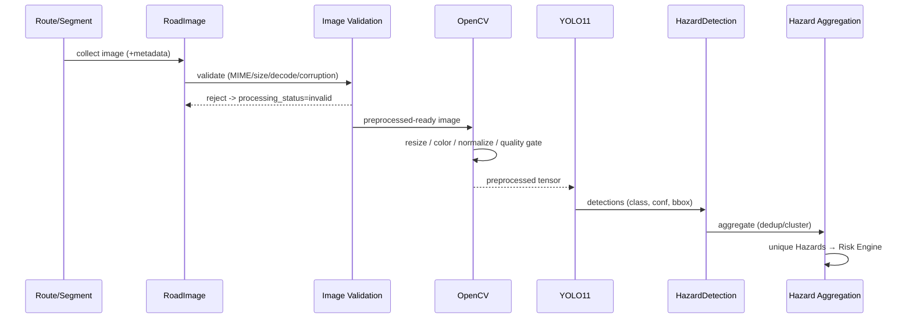

# 09_ML_SPEC.md — Machine Learning Pipeline Specification

**Project:** SafeRoute AI — Intelligent Road Safety Navigation System
**Document:** Authoritative Machine Learning Pipeline Specification
**Version:** 1.0
**Status:** Implementation-Ready
**Authority:** `MASTER_RULES.md` > `01_PRD.md` > `02_TRD.md` > `03_ARCHITECTURE.md` > `04_DATA_MODEL.md` > `05_DATA_SOURCES.md` > `06_AI_SOURCES.md` > this document
**Companion:** `06_AI_SOURCES.md` (data/model sources), `10_RISK_ENGINE.md` (consumer of detections), `10_SECURITY.md` (integrity), `09_ERROR_HANDLING.md` §10.3–§10.4, `19_REAL_WORLD_OPERATION.md` (operational constraints on inference)

---

## 1. PURPOSE

Define exactly how SafeRoute AI moves a road image from a route segment through OpenCV preprocessing into YOLO11 inference, producing structured, traceable `HazardDetection` records — and what the system does when any step fails.

Non-negotiable boundaries:

- OpenCV preprocesses images; YOLO11 detects hazards. Never reversed, never blurred (`MASTER_RULES.md` §7).
- Detections are **image-level results, NOT unique physical hazards** (`MASTER_RULES.md` §12; `04_DATA_MODEL.md` §7.10).
- Detection confidence is **NOT** road danger (`MASTER_PROJECT_PROMPT.md` §15).
- Every detection traces to a model version (`MASTER_RULES.md` §8, §25).
- The LLM never touches this pipeline (`MASTER_RULES.md` §16).

---

## 2. HARD BOUNDARIES

1. OpenCV = preprocessing only. It is never described as the detector unless a real OpenCV-based detection algorithm exists.
2. YOLO11 = detection only. It never trains in production; the training script never runs in production (`03_ARCHITECTURE.md` §6.5).
3. Classes come ONLY from `ml/dataset/data.yaml`.
4. A failed model never produces fabricated detections; safety becomes `unavailable`.
5. Malformed/adversarial images are rejected before inference — never fed to the model.
6. Inference is isolated: no route/analysis context affects detections; equal input + equal model/config → equal output.

---

## 3. FULL CV PIPELINE

```
ROUTE (route_id)
  ↓
ROUTE SEGMENT (segment_id)
  ↓ image collection + provenance (05_DATA_SOURCES.md §2)
ROAD IMAGE (image_id, lat, lon, timestamp, source)
  ↓
IMAGE VALIDATION ── reject: malformed, wrong MIME, corrupt, oversized
  ↓
OPENCV PREPROCESSING (resize→model input, color, normalize, noise, contrast, quality gate)
  ↓
YOLO11 INFERENCE
  ↓
IMAGE-LEVEL DETECTIONS (class, confidence, bbox — NOT hazards yet)
  ↓ attach route_id, segment_id, image_id, model_version
HazardDetection ROW (04_DATA_MODEL.md §7.9)
  ↓
HAZARD AGGREGATION (dedup/cluster → Hazard) → Risk Engine (10_RISK_ENGINE.md)
```

Each stage is independently testable; optional-stage failures are contained per `09_ERROR_HANDLING.md`.

### 3.1 Handoff contract to hazard aggregation

- The CV pipeline persists `HazardDetection` rows and stops. It MUST NOT count, cluster, or "decide" hazards itself.
- Duplicate suppression (the same pothole in 5 overlapping images) is the aggregation layer's job (`MASTER_RULES.md` §12; `04_DATA_MODEL.md` §7.10).
- Detections carry enough provenance (route, segment, image, bbox, confidence, geo when available) for aggregation and the Risk Engine to operate without re-running inference.
- `HazardDetection` and `Hazard` are separate entities; the pipeline produces the former only.



---

## 4. OPENCV RESPONSIBILITY BOUNDARY

### 4.1 Allowed

- Image loading and readability check.
- Validation (dimensions, type).
- Resize to the trained model input size.
- Color conversion (as required by the framework, e.g. BGR→RGB).
- Normalization (scaling, mean/std if the trained model requires it).
- Noise reduction and contrast enhancement (documented, conservative).
- Image quality checks (blur, exposure, corruption, occlusion heuristics).
- Frame extraction where applicable.

OpenCV MUST be described as **preprocessing**, never as the hazard detector (`MASTER_RULES.md` §7; `02_TRD.md` §20).

### 4.2 Forbidden

- Describing OpenCV as the detection model.
- Running any untrained/"classical" detection and labeling it as the model output.
- Altering coordinate/geometry truth.
- Unvalidated transformations that change trained-model assumptions (`02_TRD.md` §19).

### 4.3 Success/failure contract

- Success → `ImageProcessingResult.status = succeeded`, applied operations recorded (`04_DATA_MODEL.md` §7.8).
- Failure → `status = rejected|failed` + reason; the image is excluded from inference; the segment is reported "not analyzed", **never** "no hazards" (`09_ERROR_HANDLING.md` §10.2–§10.3).
- `UNIQUE(image_id, preprocessing_version)` keeps preprocessing history.

### 4.4 Preprocessing versioning

- A `preprocessing_version` identifies the exact OpenCV pipeline (ops, params, input size) so results are reproducible and cache keys valid (`MASTER_RULES.md` §33).
- Pipeline changes that alter model inputs require re-validation against the trained model and a new preprocessing version.

---

## 5. YOLO11 MODEL CONFIGURATION

Configuration via environment/config (`02_TRD.md` §72); values are NEVER hard-coded (`MASTER_RULES.md` §24):

| Variable | Meaning | Notes |
|----------|---------|-------|
| `MODEL_PATH` | artifact location | loaded once per process (§9) |
| `MODEL_NAME` | e.g. `SafeRoute-YOLO11` | recorded on every detection |
| `MODEL_VERSION` | registered version | must match the active `ModelVersion` row |
| `CONFIDENCE_THRESHOLD` | minimum confidence to keep a detection | 0..1, configurable |
| `YOLO_IOU_THRESHOLD` | NMS IoU threshold | 0..1, configurable |

- Operating values are frozen in `ModelVersion.inference_configuration`. Suggested starting ranges: `CONFIDENCE_THRESHOLD` 0.25–0.50, `YOLO_IOU_THRESHOLD` 0.45–0.50 — final `[DECISION REQUIRED]` until a project decision records empirical values.
- Thresholds MUST NOT be changed ad hoc by an agent; changes go through config plus a new `ModelVersion` record (`02_TRD.md` §24).

### 5.1 Class source rule

- The ONLY source of truth for classes is `ml/dataset/data.yaml` `names` (`06_AI_SOURCES.md` §4.3).
- The application reads the class list from the loaded model/dataset config; it never hard-codes a class array absent from the dataset (`02_TRD.md` §23).
- A class index with no matching `data.yaml` name is a fatal configuration error → reject the result (`MODEL_VERSION_MISMATCH`).

---

## 6. YOLO OUTPUT STRUCTURE

One detection, as delivered to the application:

```json
{
  "detection_id": "det_001",
  "image_id": "image_1",
  "route_id": "route_1",
  "segment_id": "segment_1",
  "class_id": 0,
  "class": "pothole",
  "confidence": 0.91,
  "bounding_box": { "x1": 120, "y1": 80, "x2": 310, "y2": 240 },
  "model_name": "SafeRoute-YOLO11",
  "model_version": "v1.0.0",
  "confidence_threshold": 0.25,
  "latitude": 12.95,
  "longitude": 77.60
}
```

Facts:

- `class` is a `data.yaml` name; `class_id` matches its index (`06_AI_SOURCES.md` §4.3).
- `latitude`/`longitude` are carried from the image **only when the image has them** (`04_DATA_MODEL.md` §7.6); otherwise `null` — never projected or invented.
- Persisted as `HazardDetection` with a `model_version_id` FK (`04_DATA_MODEL.md` §7.9).
- `bounding_box` is pixel space of the preprocessed image, documented as such.
- The output includes model version and threshold so results are reproducible and comparable.

---

## 7. CONFIDENCE SEMANTICS

- `confidence` = the detector's estimated probability that the box matches the class, at the configured threshold/IoU.
- Detection confidence is NOT road danger, NOT severity, NOT a safety guarantee, NOT a risk component.
- Road danger is computed separately and deterministically by the Risk Engine (`10_RISK_ENGINE.md`) from **aggregated** hazards.
- The UI MUST NOT imply `91% confidence = 91% danger` (`MASTER_PROJECT_PROMPT.md` §15; `02_TRD.md` §24).
- Detections below `CONFIDENCE_THRESHOLD` are dropped at inference; the threshold is stored with the model so results remain comparable (`MASTER_RULES.md` §33).

---

## 8. MODEL VERSIONING

- `ModelVersion` is `UNIQUE(model_name, model_version)` (`04_DATA_MODEL.md` §7.13).
- Every detection references the exact version that produced it; cache keys include `image_id + model_version` (`MASTER_RULES.md` §33).
- **Never silently swap the model**: activation updates `MODEL_PATH`/`MODEL_VERSION`, sets a new `ModelVersion.status = active`, retires the previous active row, and invalidates model-version-dependent caches.
- Historical results remain traceable: they keep their recorded `model_version_id` even after the model is replaced.

---

## 9. MODEL LOADING

- Load once per process at startup (or lazily with a warm-up), then reuse across images (`03_ARCHITECTURE.md` §6.4; `02_TRD.md` §87).
- Load-time checks:
  1. Artifact exists and sha256 matches `ModelVersion.checksum` (`10_SECURITY.md`; `06_AI_SOURCES.md` §7).
  2. `MODEL_NAME`/`MODEL_VERSION` match the registered active record.
  3. Class count matches `data.yaml`.
- Load failure → the system stays up; YOLO status `unavailable`; route, distance/duration, and facilities preserved (`09_ERROR_HANDLING.md` §10.4).
- Per-request reload is forbidden except where isolation demands a separate model process (§11).

---

## 10. MODEL FAILURE BEHAVIOR

| Failure | Handling |
|---------|----------|
| Artifact missing / corrupt / checksum mismatch | `MODEL_LOAD_FAILED` (CRITICAL log); model status `unavailable`; health reports degraded |
| Inference runtime error (bad tensor, OOM) | bounded per-image retry (max 1); then that image `failed`, never fabricated |
| Class/index mismatch | `MODEL_VERSION_MISMATCH`; reject detections lacking provenance (`09_ERROR_HANDLING.md` §5) |
| Model down entirely | `analysis.safety.status = unavailable`; route/distance/duration, facilities, and LLM (on available data) still returned |

- One failed image → `processing_status = failed`; remaining images continue.
- Persistent whole-model failure → safety domain `unavailable`; frontend renders the unavailable state, never `risk: 0` (`08_UI_SPEC.md` §14; `09_ERROR_HANDLING.md` §13).

Retry/fallback rules follow the matrix in `09_ERROR_HANDLING.md` §11: YOLO per-image retry min 1, stateless/idempotent; never retry malformed input.

---

## 11. INFERENCE ISOLATION, CPU/GPU & RESOURCE CAPS

- **Isolation:** inference is stateless — output depends only on (image, model version, config). No cross-route interaction; independent routes may analyze concurrently (`02_TRD.md` §88).
- **CPU/GPU:** device is configuration (inference config / `ModelVersion.inference_configuration`). GPU is optional; CPU fallback is supported so the app runs without GPU.
- **Resource caps:** inference concurrency is capped so total VRAM/RAM/CPU stay under a configured ceiling (`MAX_INFERENCE_CONCURRENCY` or equivalent). Saturation → backpressure/503, never OOM (`09_ERROR_HANDLING.md` §5).
- **Determinism:** same image + same model version + same config → same detections (`10_RISK_ENGINE.md` determinism requirement).

---

## 12. ADVERSARIAL / MALFORMED IMAGE REJECTION

Before any inference the image MUST pass:

1. **Safe decode** — OpenCV decodes in-process; decode failure → `invalid`, never passed on.
2. **Type validation** — MIME/extension/signature checks; never trust extension alone (`02_TRD.md` §76).
3. **Size limits** — `IMAGE_MAX_SIZE` and pixel-dimension caps.
4. **Corruption heuristics** — truncated, unreadable, or zero-size files rejected.
5. **Adversarial input handling** — decoder-exploit attempts, surprising payloads, mismatched header/body → rejected at validation, logged as security-relevant (`09_ERROR_HANDLING.md` §5); the YOLO process never receives them.
6. **No raw-byte logging** — images are never logged as payloads.

Rationale: OpenCV + model only ever process bytes that passed validation (`MASTER_PROJECT_PROMPT.md` §44/§46; `10_SECURITY.md`).

---

## 13. EVALUATION & MONITORING

- Metrics per `06_AI_SOURCES.md` §10 (precision/recall/mAP/F1/per-class) on the held-out test set.
- Runtime metrics: `yolo_inference_count`, `yolo_inference_duration`, per-version latency, failure rate, rejected/gated-image rate (`02_TRD.md` §159; `09_ERROR_HANDLING.md` §14).
- Drift/quality monitoring (e.g. suspicious empty-detection-ratio changes) triggers alerts on verified thresholds only — never fake progress numbers (`MASTER_PROJECT_PROMPT.md` §51).

---

## 14. RELATED DOCUMENTS

- `06_AI_SOURCES.md` (dataset/model provenance, lifecycle, metrics, artifacts)
- `10_RISK_ENGINE.md` (hazard → deterministic risk; this pipeline feeds it)
- `10_SECURITY.md` (artifact integrity, image upload security)
- `09_ERROR_HANDLING.md` §5, §10.3–§10.4, §11 (retry/fallback matrix)
- `04_DATA_MODEL.md` §7.8–§7.10, §7.13 (entities)
- `19_REAL_WORLD_OPERATION.md` (temporal/weather/lighting limitations on inference)
- `02_TRD.md` §19–§25, §76, §87–§88, §159

---

# END OF MACHINE LEARNING PIPELINE SPECIFICATION